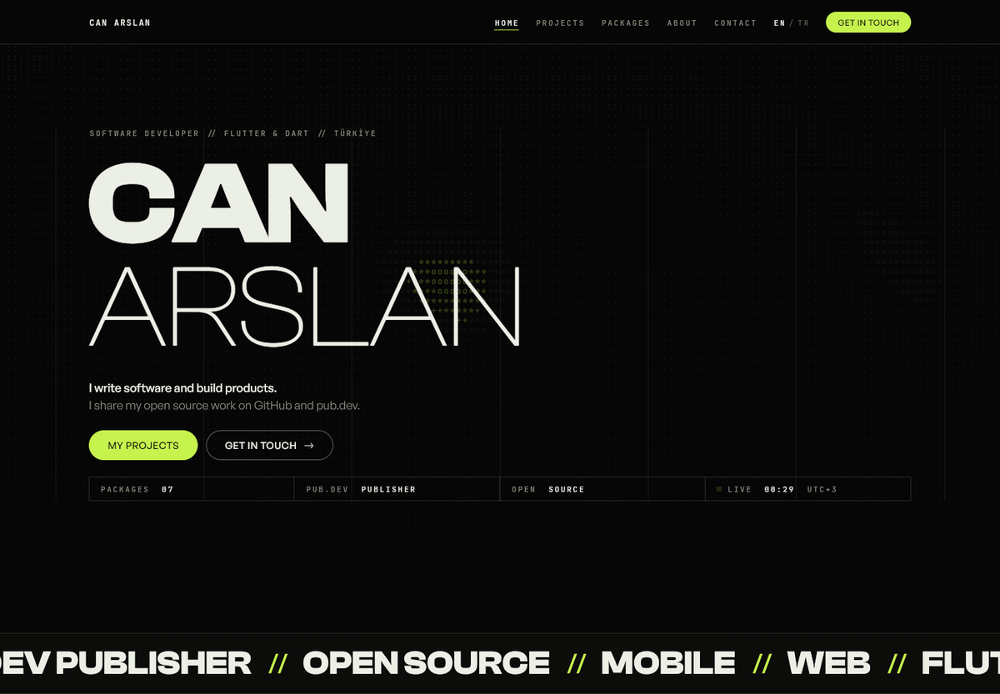
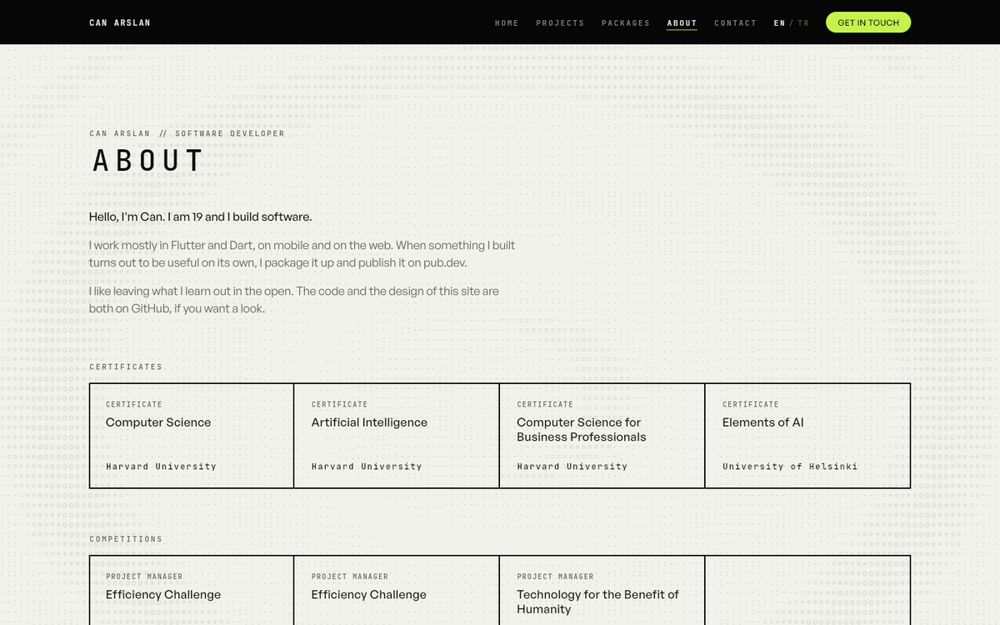

# canarslan.me

My personal site. Flutter, web only, live at [canarslan.me](https://canarslan.me).



Most portfolio sites are a template with someone's name dropped into it. This
one is an excuse to build a design system properly and then be held to it.

The system is called SIGNAL and it comes down to three rules. Structure is
carried by 1px hairlines, not shadows or elevation. Corners are either square
or fully round, with nothing in between. There is one accent colour and it may
appear at most three times on a page.

[`DESIGN.md`](DESIGN.md) writes that down, and `test/design_rules_test.dart`
reads the source and fails the build when code steps outside it. A hex literal,
a raw `TextStyle`, a `BorderRadius.circular(8)` — the test finds them and says
which rule they broke. It is the part of this repo I would actually recommend
stealing.

There is a hidden route at `/design` that renders every token and component
from the live code, so the documentation cannot drift from the thing it
documents. It is deliberately not linked from the navigation. A component that
is not in there does not exist.

## Things worth knowing

**The background texture is one draw call.** Each ASCII field is a monospace
grid running an interference function, drawn through a glyph atlas baked once
for the whole app and a single `drawRawAtlas` per frame. A page runs up to five
of them at once, so they step on a timer rather than a ticker (11 wakeups a
second instead of 60), repaint through a `ValueNotifier` without rebuilding any
widget, reuse their sprite buffers, and fold their opacity into each glyph's
alpha instead of asking for a full-screen `saveLayer`.

**The copy is compile-checked, in both languages.** Every string lives in
`lib/i18n/site_copy.dart` as a `Copy(en, tr)` pair on adjacent lines. There is
no key lookup and no fallback, so a string cannot be added in one language and
forgotten in the other, and a typo is a build error instead of a key printed
onto the page. English is the default; the switch is in the nav bar.

**Nothing is faked.** Package data comes from pub.dev's JSON API, repositories
from GitHub's, and the contribution calendar from a JSON endpoint that allows
cross-origin requests — no proxy in front of any of them, which is what broke
the last version of this site. Reads are cache-first with a six-hour window, so
a repeat visit makes no requests at all.

**The tests are the real check.** Release builds strip `assert`, which hides
exactly the failures Flutter web is prone to. Every page is built at three
widths in both languages with assertions on, and the render tree is walked at
390 × 844 looking for anything laid out wider — or narrower — than its column.
83 tests, and several of them exist because they caught something a release
build rendered without complaint.



## Running it

```bash
flutter pub get
flutter run -d chrome

flutter analyze          # must be clean
flutter test             # must be green
flutter build web --release
```

Three dependencies: `get` for routing, `http` for the three JSON endpoints, and
`web` for the handful of browser APIs the site touches. The three typefaces are bundled
as assets rather than fetched at runtime — Clash Display and General Sans under
the Fontshare Free Font Licence, JetBrains Mono under the SIL OFL, both in
`assets/fonts/`.

## Layout

```
lib/
  design/     the SIGNAL system: tokens, theme, components
  pages/      one folder per route, plus the /design storybook
  i18n/       every string the site says, in both languages
  data/       typed models and the cached repository
  services/   pub.dev, GitHub, storage, navigation
docs/         the signed-off HTML prototype, and the shots above
tool/         generates the social card from the site's own palette
test/         pages, storybook, routes, and the design-rule guard
```

[`CLAUDE.md`](CLAUDE.md) is the working notes: why the router replaces instead
of pushing, why the Wasm build is off, what the deploy needs. It is written for
whoever picks this up next, which is usually me six months later.

## Deploying

The built output goes to a separate repository that GitHub Pages serves. Build,
then publish the contents of `build/web`:

```bash
flutter build web --release
```

Everything the deploy needs is in `web/` and comes out of the build: `CNAME` so
replacing the published tree cannot take the custom domain with it, `404.html`
so deep links survive a host that only serves real files, and `og.png` with the
meta tags for link previews. The card is generated by `tool/og_card.py` from
the site's own palette, fonts and background field, so it can be rebuilt when
the design moves rather than sitting there as a stale picture.

## Licence

MIT, in [`LICENSE`](LICENSE). The fonts are not mine to relicense; their terms
are in `assets/fonts/`.
